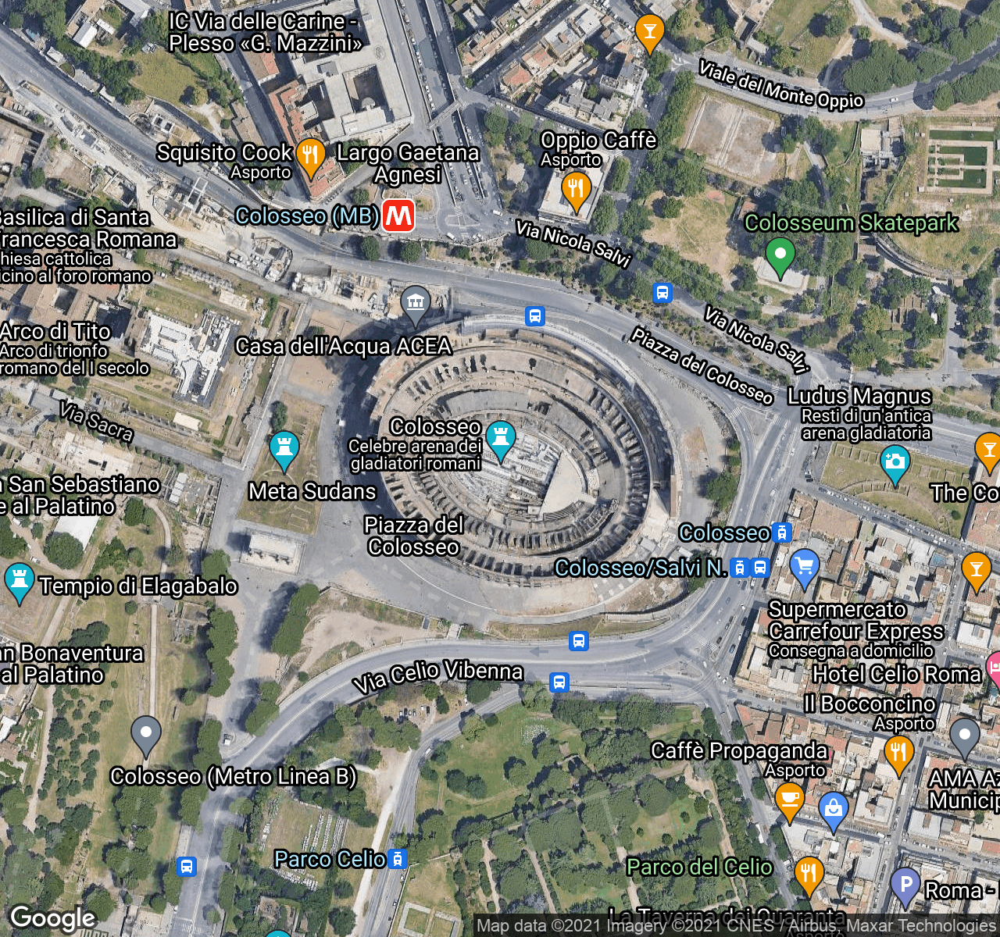

# gmaps_static
## Example

```rust
use gmaps_static::*;

let map = Map::new("YOUR_API_KEY".into(), (400, 300).into())
    .scale(SCALE2)
    .center("Colosseo".into())
    .zoom(STREETS)
    .format(GIF)
    .maptype(HYBRID)
    .region("it".into())
    .language("it".into());

println!("{}", map.url());
```

This will generate the following URL:

```plain
https://maps.googleapis.com/maps/api/staticmap?size=400x300&center=Colosseo&scale=2&format=gif&maptype=hybrid&language=it&region=it&key=YOUR_API_KEY
```




## Features

 - [x] center
 - [x] zoom
 - [x] size
 - [x] scale
 - [x] format
 - [x] maptype
 - [x] language
 - [x] region
 - [x] markers
 - [x] paths
   - [ ] [encoded polyline paths](https://developers.google.com/maps/documentation/utilities/polylinealgorithm)
 - [x] viewports (`visible` parameter)
 - [x] styled maps
   - [x] support for `map_id` parameter
   - [x] support for URL-based styles (`style` parameter)
 - [X] [Clientid authentication](https://developers.google.com/maps/premium/apikey/maps-static-apikey#generating_valid_signatures)


## TODO list pre-1.0.0

 - [x] Remove ambiguous type aliases in favour of wrapper types
 - [x] Remove immutability and implement `clone()` in builder struct
 - [ ] Better error management
 - [ ] Proper crate documentation
 - [x] Examples
 - [ ] More test (support for all examples in the official docs)